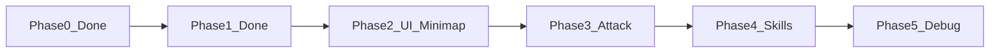

# Dark Dungeon Web Demo 从 0 到 1 开发计划（更新版）

## 文档与阶段对应关系

- **[PRDs/plan.md](PRDs/plan.md)**：第一阶段（已完成）、**第二阶段（Gemini 建议）**：UI 布局、小地图、攻击/技能按钮交互及对应 Cursor Prompt。
- **[PRDs/design.md](PRDs/design.md)**：整体 PRD（3C 状态流、战斗/技能、小地图、事件飘字、Debug、技术建议）。

以下每个关键节点都会标明「文档提醒」，开发到该节点时请打开对应文档核对。

---

## Phase 0：项目初始化（已完成）

- 已采用单文件 `index.html` + Three.js + Cannon-es；Canvas 全屏、viewport 与 resize 已适配移动端。

---

## Phase 1：3D 基础环境与移动端 3C（已完成）

- 场景（50×50 地板、障碍盒、胶囊体+朝向、CharacterManager.loadModel）、摇杆、右侧触摸转视角、第三人称相机 lerp、Jump/Crouch 均已实现。PC 端已补充 WASD 与角色竖直锁定。
- 验收清单见 [plan.md「Phase 1 验收清单」](PRDs/plan.md)。

---

## Phase 2：UI 布局与小地图同步系统（已完成）

**目标：** 按 plan.md 第二阶段（Gemini 建议）建立完整 HUD、小地图与攻击/技能按钮布局，为后续战斗与技能逻辑提供 UI 底座。

### 2.1 UI 全局布局

- **左上角：** 玩家属性预留（角色 ID、血条/蓝条预留位、金币数显示）。
- **右上角：** 设置/菜单按钮。
- **左下角：** 虚拟摇杆（已有，可优化视觉）。
- **右下角：** 攻击键（最大）、三个技能键（环绕）、跳跃与下蹲（较小）；与现有 Jump/Crouch 整合。
- **左侧中部：** 简易任务引导或提示文字预留。

**文档提醒：** [plan.md「第二阶段 - 1. UI 全局布局」](PRDs/plan.md)。

### 2.2 小地图系统

- **双摄像头方案：** 正交摄像机 (Orthographic Camera) 垂直向下看玩家所在区域。
- **渲染目标：** 小地图内容渲染到小正方形容器（如 150px），置于左上角（与血条/金币区域协调）。
- **同步逻辑：** 小地图中心跟随玩家 (x, z)；玩家在小地图上为方向箭头，旋转角度同步 3D 朝向。
- **视觉：** 简化暗灰块代表墙壁/障碍，高亮或箭头代表玩家。

**文档提醒：** [plan.md「第二阶段 - 2. 小地图系统」](PRDs/plan.md)；[design.md 3.3 小地图](PRDs/design.md)。

### 2.3 攻击与技能按钮交互

- **视觉反馈：** 按钮按下时缩放 (scale down) 与变色。
- **冷却效果：** 技能按钮预留冷却遮罩（如 2 秒半透明灰罩或 SVG 转圈），点击后触发 `console.log("Skill [N] Cast")` 等。
- **攻击键：** 点击时控制台输出 `Action: Attack`，并预留连招计时器（二段攻击判断）。

**文档提醒：** [plan.md「第二阶段 - 3. 攻击与技能按钮交互」](PRDs/plan.md)。

### 2.4 适配与响应式

- **安全区域：** UI 避开刘海与底条（safe-area-inset）。
- **横竖屏：** 小地图与按钮组随屏幕尺寸调整。

**文档提醒：** [plan.md「第二阶段 - 4. 适配与响应式」](PRDs/plan.md)。

### Phase 2 Cursor Prompt

可直接使用 [plan.md 中「给 Cursor 的 Prompt 指令」](PRDs/plan.md)（Minimap、Game HUD Overlay、Interactivity、Styling、Optimization），在现有 index.html 上扩展，保持与现有摇杆/相机触摸区不冲突。

---

## Phase 3 与 Phase 4 对照分析（含 plan.md 第三阶段与攻击动画优化）

下表将**原开发计划 Phase 3/4** 与 **plan.md 新增内容**（第三阶段 MOBA 技能交互、胶囊体攻击动画优化）做对应，便于合并执行：

| 来源           | 内容                                              | 合并后归属                                           |
| ------------ | ----------------------------------------------- | ----------------------------------------------- |
| 原 Phase 3    | 状态流 Idle→Run→Jump→Crouch→Attack                 | Phase 3：状态位/简单状态机                               |
| 原 Phase 3    | 攻击键 → 近战挥砍 + 事件飘字                               | Phase 3：已有（tryHitEnemy + addFloatingDamage）     |
| plan.md 新增   | 攻击动画优化：Dash/回弹、Squash and Stretch、挥砍弧光、Hit Stop | **Phase 3 增强**：在现有攻击逻辑上加表现层                     |
| 原 Phase 4    | Skill A 瞬间 / B 长按 / C 指向性 + 指示器                 | Phase 4：释放方式与指示器类型                              |
| plan.md 第三阶段 | S1 扇形、S2 直线、按下-拖动-释放、取消区                        | **Phase 4 具体实现**：S1/S2 用 MOBA 指示器，S3 可保持点击或接同一套 |

**技能映射建议（与 design.md 一致）：**

- **Skill A（瞬间释放）**：对应当前 S3 或某键，点击即释放，无指示器。
- **Skill B（长按引导）**：预留长按逻辑，可与 S2 或单独键位绑定，Phase 5 Debug 可切换。
- **Skill C（指向性 + 指示器）**：对应 S1（扇形）与 S2（直线），实现「按下出指示器 → 拖动瞄准 → 松手施法/取消区取消」。

**执行顺序建议：** 先做 Phase 3（状态流 + 攻击表现优化），再做 Phase 4（S1/S2 指示器与取消区，S3 与 A/B/C 映射 + Debug 预留）。

---

## Phase 3：角色状态与攻击（含攻击表现优化）

**目标：** 实现 design.md 中的角色状态流、攻击逻辑与事件飘字；并用 plan.md「攻击动画模拟优化方案」增强攻击手感。

**实现顺序：** 先做 3.1 状态流（若有需要再细化），再按 3.2 逐项实现攻击表现（防重入 → Dash → Squash/Stretch → 弧光 → Hit Stop），最后按 3.3 验收。

### 3.1 状态流（原 Phase 3）

- **状态流：** Idle → Run → Jump → Crouch → Attack（与现有移动/跳跃/下蹲对接）。可用一个变量如 `characterState`（'idle'|'run'|'jump'|'crouch'|'attack'）或仅用现有 `isCrouching` + 是否在移动/跳跃推断，供后续 UI 或 Debug 显示；不强制完整状态机。
- **攻击键：** 点击触发近战挥砍（已有 tryHitEnemy + 飘字，保持不变）。
- **事件飘字：** 已实现 addFloatingDamage，可保留或微调样式。

### 3.2 攻击表现优化（plan.md 新增，并入 Phase 3）

在**不改变**现有命中判定与飘字的前提下，在 `btnAttack` 的 click 回调内增加表现层逻辑。

| 子项                 | 说明             | 实现要点                                                                                                                                                                                                                    |
| ------------------ | -------------- | ----------------------------------------------------------------------------------------------------------------------------------------------------------------------------------------------------------------------- |
| 防重入                | 攻击动画播放中不再响应新攻击 | 增加 `isAttacking` 标志，动画结束（约 0.4s）后清除；在 click 开头若 `isAttacking` 则 return。                                                                                                                                                 |
| Dash 与回弹           | 视觉前冲 + 回位      | 用 `attackOffset`（THREE.Vector3）表示相对 body 的视觉偏移。TWEEN：0→0.6 沿 cameraYaw 方向（0.1s），再 0.6→0（0.25s，Exponential.Out）。每帧在 `updateVisual()` 之后执行 `character.group.position.add(attackOffset)`；TWEEN 只更新 `attackOffset`，不改 body。 |
| Squash and Stretch | 胶囊缩放形变         | 时间轴：0s 蓄力 (1.2,0.8,1.2)，0.1s 爆发 (0.8,1.4,0.8)，0.1～0.4s 弹性回 (1,1,1)。若当前 `isCrouching`，恢复时回到 CROUCH_SCALE 的 y 缩放而非 1，避免与下蹲冲突。                                                                                             |
| 挥砍弧光               | 武器轨迹弧面         | 攻击开始时在角色前方（沿 cameraYaw、y 略高于脚底）创建 Mesh：RingGeometry 或扇形，张角 120°，半透明（#d4af37 或 #4a90e2）。0.2s 内旋转约 120° 并 opacity→0，然后 remove + dispose。                                                                                  |
| Hit Stop（可选）       | 命中顿帧           | 若 tryHitEnemy 本帧命中，则 dash 回弹延迟 0.05s 开始，或 TWEEN 暂停 0.05s。                                                                                                                                                               |

**依赖：** 引入 TWEEN.js（CDN）；若无则用手写 requestAnimationFrame + 缓动函数（如 easeOutExpo）实现上述时间轴。

**文档提醒：** [design.md 3.1/3.2/3.3](PRDs/design.md)、[plan.md 胶囊体攻击动画优化方案 + 给 Cursor 的优化指令](PRDs/plan.md)。

### 3.3 Phase 3 验收清单

- 攻击键按下后有前冲与回弹，且物理 body 不瞬移。
- 攻击过程中胶囊有蓄力压扁、爆发拉长、弹性恢复（或恢复至下蹲比例）。
- 挥砍弧光在角色前方出现并旋转淡出。
- 命中敌人时可有短暂 Hit Stop（可选）。
- 攻击动画播放期间连点不重复触发表现、不打断已有动画。
- 现有 tryHitEnemy、飘字、敌人血条、移动/跳跃/下蹲/相机/小地图均正常。

---

## Phase 4：技能系统（含 MOBA 指示器与 Debug 预留）

**目标：** 三个技能 (A/B/C) 的释放方式与指示器，并预留 Debug 对接；其中 S1/S2 按 plan.md 第三阶段实现「类王者荣耀」拖拽瞄准。

**实现顺序：** 先实现 S1 的「按下-拖动-释放」与取消区，再复用到 S2（仅换指示器几何）；S3 保持现有点击逻辑；最后补 4.3 Debug 预留与 4.4 验收。

### 4.1 技能与 design.md 对应

- **S1（扇形）**：对应 Skill C 指向性之一，按下-拖动-释放，扇形指示器（半径 5、90°）。
- **S2（直线）**：对应 Skill C 指向性之二，同上操作，直线矩形（长 10、宽 2）。
- **S3**：保持**点击即释放**，对应 Skill A 瞬间释放；无指示器。Skill B（长按引导）预留，Phase 5 Debug 可切换。

### 4.2 指示器与操作（plan.md 第三阶段）

| 子项  | 说明                                                       | 实现要点                                                                                                                                                                               |
| --- | -------------------------------------------------------- | ---------------------------------------------------------------------------------------------------------------------------------------------------------------------------------- |
| 按下  | touchstart / mousedown 于 S1 或 S2 按钮                      | 在角色脚底世界坐标（y=0.01）创建指示器 Mesh，初始 rotation.y = cameraYaw；记录「当前瞄准技能」skillIndex（1 或 2）及按钮中心/触点，用于后续拖拽计算。                                                                                |
| 拖动  | touchmove / mousemove（需在 document 或 window 上监听，避免移出按钮丢失） | 用触点与按钮中心的 2D 偏移 (dx, dy) 计算角度：`angle = Math.atan2(dy, dx)`，转换为 3D 的 yaw（注意屏幕坐标系与 3D 的对应，如 yaw = -angle 或 + 半周）。更新指示器 `rotation.y`；可选 lerp 使旋转更平滑。每帧将指示器 position 同步到角色脚底（角色可能在移动）。 |
| 取消区 | 屏幕上方区域                                                   | 定义阈值如 `clientY < window.innerHeight * 0.15` 为取消区。拖入时：指示器材质颜色改为 #ff4d4d；松手时不调用 tryHitEnemy/startSkillCooldown，仅移除指示器。                                                               |
| 释放  | touchend / mouseup                                       | 若在取消区则仅销毁指示器；否则执行现有 tryHitEnemy(SKILL_RANGES[skillIndex-1], SKILL_DAMAGES[skillIndex-1], ...)、startSkillCooldown(skillIndex)，再销毁指示器。释放后清除「当前瞄准技能」状态。                               |

**指示器规格：**

- **S1 扇形：** THREE.Shape + ShapeGeometry 或 ConeGeometry 取 1/4 扇面；半径 5，张角 90°；MeshBasicMaterial transparent true、opacity 0.4，颜色 #4a90e2 或 #d4af37；贴地 y=0.01。
- **S2 直线：** PlaneGeometry(10, 2)；材质同上；贴地 y=0.01。

**S1/S2 事件：** 在 btnSkill1、btnSkill2 上绑定 touchstart/mousedown 启动瞄准；为不丢失 move/end，在 document 上绑定 touchmove/touchend、mousemove/mouseup（通过 pointerId 或 touchId 判断是否为当前技能的手指），释放后解绑或通过「当前瞄准技能」为 null 忽略。

### 4.3 Debug 预留

- 预留全局或模块内配置：如 `skillTriggerMode: 'instant' | 'charge' | 'directional'`、`indicatorType: 'none' | 'sector' | 'linear'`，Phase 5 菜单可修改；本阶段 S1/S2 固定为 directional + 对应指示器，S3 固定为 instant。

### 4.4 Phase 4 验收清单

- S1：按下出现扇形指示器，拖动时指示器随手指旋转，松手在非取消区施法并进入冷却，松手在取消区仅关闭指示器；取消区时指示器变红。
- S2：同上，指示器为直线矩形。
- S3：点击即释放，无指示器，与现有逻辑一致。
- 指示器位置随角色移动更新（或仅在按下时取一次脚底位置，按需选择）。
- 不破坏攻击键、移动、跳跃、下蹲、相机、小地图、血条。

**文档提醒：** [design.md 3.2 技能按键、第 4 节 Debug 表格](PRDs/design.md)、[plan.md 第三阶段 类王者荣耀技能交互 + Cursor Prompt](PRDs/plan.md)。

---

## Phase 5：受击反馈 (Hit Feedback) Debug 模块

**目标：** 按 [plan.md「开发者文档：受击反馈 Debug 模块」](PRDs/plan.md) 实现基于 **lil-gui** 的受击反馈调试面板，包含界面切分、血条反馈、HUD 伤害跳字、状态与方位指示，以及 2 秒自动 onHit 循环与可选手动受击，便于实时预览参数调整。

**文档提醒：** [plan.md 受击反馈 Debug 模块 第 1/2 节 + 给 Cursor 的专项执行 Prompt](PRDs/plan.md)；[design.md 第 4 节 Debug](PRDs/design.md)。

### 5.1 界面与布局规范

- **屏幕切分：** 页面左侧 **1/3** 为 Debug 参数控制面板（使用 **lil-gui**）；右侧 **2/3** 为 3D 游戏预览区域（Three.js Canvas）。
- **模块化切换：** 在 Debug 面板顶部设置页签，当前默认锁定在 **「受击反馈」(Hit Feedback)** 模块。
- **自动测试循环：** 进入该模块后，代表玩家的胶囊体每隔 **2 秒** 自动触发一次 `onHit` 逻辑，以便实时预览参数调整。
- **可选：** 增加 **「Manual Hit」** 按钮，用于连击测试与多重跳字重叠时的排版验证。

### 5.2 功能架构与调试参数 (Debug Settings)

根据 plan.md 受击反馈架构图，Debug 面板需包含以下三块可调项：

#### A. 血条反馈 (Health Bar Feedback)

| 调试项        | 控件类型 | 功能描述                                                                   |
| ---------- | ---- | ---------------------------------------------------------------------- |
| **数值位置**   | 下拉菜单 | 可选：**Top, Bottom, Left, Right**。根据选择调整伤害数值与血条的相对方位，数值与血条保持固定间距（如 5px）。 |
| **下降速度**   | 滑动条  | 调节血条被扣除后的平滑缩减速度（Lerp Speed）。                                           |
| **下降颜色变化** | 色域选择 | 设置血条扣除瞬间的底色闪烁（如由绿变红或变白）。                                               |
| **反馈动效强度** | 滑动条  | 调节受击时血条本身的**抖动 (Shake)** 或**高亮 (Flash)** 频率。                           |

#### B. HUD 伤害跳字 (Floating Text)

| 调试项         | 控件类型 | 功能描述                                                                                                                                                                     |
| ----------- | ---- | ------------------------------------------------------------------------------------------------------------------------------------------------------------------------ |
| **普通/暴击区分** | 逻辑切换 | **Normal**：基础颜色与缩放，简单上飘；**Critical**：1.5 倍缩放、爆发式弹出动效（如 scale 0.1→1.5→1.0）+ 可选 screen shake。Test Mode 可选：Random(75% Normal / 25% Critical)、Always Critical、Always Normal。 |
| **颜色配置**    | 色域选择 | 分别设置 `Normal Color`（默认白）、`Critical Color`（默认亮金）；建议十六进制字符串。                                                                                                               |
| **跳字动效**    | 下拉菜单 | 可选：**向上漂浮 (Float Up)**、**中心弹出 (Zoom Pop)**、**随机抖动 (Random Shake)**。                                                                                                      |
| **持续时间**    | 滑动条  | 调节跳字从生成到完全消失的时间（0.5s～3s）。可配合滑动条：`fontSize`、`duration`。                                                                                                                   |

#### C. 状态与方位指示

| 调试项          | 控件类型  | 功能描述                            |
| ------------ | ----- | ------------------------------- |
| **受击图标弹出**   | 开关/菜单 | 模拟显示「眩晕」、「僵直」等状态图标。             |
| **被攻击方向 UI** | 开关    | 开启后，在胶囊体周围显示指向「攻击者」位置的红色 UI 箭头。 |

### 5.3 核心逻辑与 Cursor Prompt 要点

- **Environment：** 左 30% lil-gui，右 70% Canvas；2 秒 `setInterval(() => player.onHit(), 2000)`（进入受击反馈模块时启用）。
- **Damage Types：** 每次 onHit 随机 Normal(75%) / Critical(25%)。Normal：normalColor + float-up；Critical：criticalColor + Pop(0.1→1.5→1.0) + screen shake。
- **GUI：** Value Positioning 四向下拉；滑动条：`dropSpeed`、`shakeIntensity`、`fontSize`、`duration`；色域选择器用于血条闪色与跳字颜色。
- **Feedback Actions：** onHit 触发时：按 `shakeIntensity` 抖动血条；在 `valuePosition` 指定方位生成飘字；胶囊体材质短暂闪一下（可选）。

### 5.4 布局与体验

- **左侧 Debug 面板：** 使用 lil-gui 构建；若控件过多超出屏幕高度，面板需可滚动，保证所有项可操作。
- **右侧游戏区域：** 保持约 2/3 宽度，清晰展示胶囊体受击与血条/飘字变化。
- **后续交互建议（plan.md）：** 切换 Left/Top 等方位时验证 HTML/CSS 的 transform 或 flex 是否正确应用；可通过 Manual Hit 连续点击测试多重跳字重叠排版。

### 5.5 Phase 5 验收清单

- 界面：左侧 1/3 lil-gui 受击反馈模块，右侧 2/3 游戏 Canvas；顶部页签默认「受击反馈」。
- 血条反馈：数值位置四向可选；下降速度、下降颜色变化、反馈动效强度可调。
- HUD 跳字：普通/暴击区分（含 Test Mode）；颜色配置；跳字动效三选一；持续时间可调。
- 状态与方位：受击图标弹出、被攻击方向 UI 可开关（若实现）。
- 自动 2 秒 onHit 循环可实时预览；可选 Manual Hit 便于连击与重叠测试。
- onHit 时血条抖动、飘字生成、胶囊体闪色（按参数）一致。

### 5.6 与现有 Debug 的衔接

- 若已有「技能触发方式」「指示器类型」「性能信息」等 Debug 项（见 [design.md 第 4 节](PRDs/design.md)），可与此受击反馈模块通过顶部页签或同菜单并列；本阶段以受击反馈架构（A/B/C + 布局 + Cursor 专项 Prompt）为核心交付。

---

## 可选后续（美术与资源）

- 通过 CharacterManager **loadModel** 替换为 .glb 骑士模型，接入 Idle/Run/Jump/Crouch/Attack 动画。
- 地牢场景细化：石砖墙、火炬（动态光）、祭坛、宝箱（见 [design.md 第 2 节 视觉与美术需求](PRDs/design.md)）。

---

## 依赖关系简图

- Phase 2 在现有 Phase 1 代码上扩展，不破坏摇杆与相机控制。
- Phase 3 依赖 Phase 2 的 HUD/攻击键；Phase 4 依赖 Phase 2 的技能按钮与 Phase 3 的交互习惯；Phase 5 在技能与指示器就绪后联调。

---

## 执行顺序小结

| 顺序      | 阶段          | 主要产出                                                                                                |
| ------- | ----------- | --------------------------------------------------------------------------------------------------- |
| 已完成     | Phase 0 / 1 | 项目底座、3C、摇杆、相机、Jump/Crouch、障碍                                                                        |
| 已完成     | Phase 2     | HUD、小地图、攻击+3 技能按钮、冷却、安全区、飘字与敌人                                                                      |
| **下一步** | **Phase 3** | 状态流、攻击逻辑与飘字（已有）+ **攻击表现优化**（Dash/回弹、Squash and Stretch、挥砍弧光、可选 Hit Stop）                            |
| 之后      | Phase 4     | **S1 扇形 / S2 直线指示器**、按下-拖动-释放、取消区；Skill A/B/C 与 Debug 预留                                            |
| 最后      | Phase 5     | 受击反馈 Debug：lil-gui 左 1/3 右 2/3、血条反馈(数值位置/下降速度/颜色/动效)、HUD 跳字(普通暴击/动效/持续)、状态方位、2s onHit 循环、Manual Hit |

- **Phase 3** 以 [design.md 3.1/3.2/3.3](PRDs/design.md) 与 [plan.md 攻击动画模拟优化 + 给 Cursor 的优化指令](PRDs/plan.md) 为准。
- **Phase 4** 以 [design.md 3.2、第 4 节](PRDs/design.md) 与 [plan.md 第三阶段 类王者荣耀技能交互 + Cursor Prompt](PRDs/plan.md) 为准。
- **Phase 5** 以 [plan.md 开发者文档：受击反馈 Debug 模块 + 给 Cursor 的专项执行 Prompt](PRDs/plan.md) 为准。

---

## 执行前确认（请与开发确认后再开始）

- **Phase 3**：先做攻击表现优化（TWEEN + attackOffset、Squash/Stretch、挥砍弧光、可选 Hit Stop），状态流可按需简化（如仅增加 characterState 用于 Debug）。确认是否需实现完整 Idle/Run/Jump/Crouch/Attack 状态机，还是仅保持现有逻辑 + 表现层即可。
- **Phase 4**：S1/S2 改为「按下-拖动-释放」+ 取消区，S3 保持点击即释放；确认 S1/S2 是否都要在本阶段实现，以及取消区比例（当前建议屏幕顶部 15%）是否合适。
- **统一修改文件：** 仅 [index.html](e:\siqi.yi\agenticDesigner\ingameEnvironment\index.html)；先完成 Phase 3 并自测通过，再开发 Phase 4。

