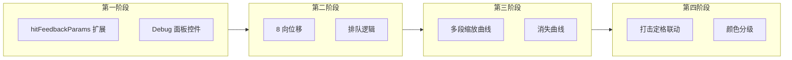

# HUD 飘字动效迭代开发计划

## 一、对 PRD 新增内容的理解

**目标**：把打击感从“简单数值+固定上飘”升级为**可配置的动画引擎**，支持三种确认的细节：

- **预设 + 滑杆双轨**：既有 8 向/缩放预设，也有手动 X/Y、强度滑杆。
- **2D 屏幕平面位移**：轨迹在投影到屏幕后再用 2D 矢量计算，而非仅在 3D 世界。
- **重叠/排队开关**：Overlap（当前行为）与 Queue（新字向上堆叠不重叠）可切换。

**四阶段逻辑关系**（建议按顺序实现，避免返工）：

---

## 二、现状与扩展点

**现有实现**（[index.html](e:\siqi.yi\agenticDesigner\ingameEnvironment\index.html)）：

- `FloatingTextManager.add`：创建 DOM、写入 `floatingTexts`，带 `worldPos, time, duration, isCritical, animType`。
- `updateFloatingText()`（主循环内）：每帧用 `projectWorldToScreen` 得到屏幕坐标，`applyValuePositionOffset` 仅支持 4 向（上/下/左/右）固定像素偏移；位移为线性 `offY = time * 40`；缩放仅 `zoomPop` 在暴击时 0.1→1.5→1.0；透明度线性 `1 - time/dur`。
- `hitFeedbackParams` 已有：`valuePosition`、`duration`、`floatAnim`、`normalColor`、`criticalColor`、`fontSize` 等，无 `motion`/`scale`/`fade` 子对象及 `stackingMode`。

**待补能力**：

- 位移：8 向预设 + 手动 X/Y 强度；公式 `ScreenPos = ProjectedPos + Vector × Intensity × Progress`。
- 排队：Queue 模式下新字 Y 偏移 = 当前队列中“同一目标”已存在飘字的最高 Y + 字高 + Gap；**Queue 仅对同一敌人（同一 target）产生的跳字生效**，不同敌人的飘字各自排队，不混在一起，避免全屏排一队导致混乱。
- 缩放：多预设（PopUp / Dive / Static）+ 强度滑杆，用 TWEEN.Easing（如 Back.Out、Elastic）。
- 消失：多种曲线（Linear / BackOut / EaseIn / Steps），以及“Stay & Flash”（前 80% 不透明、末 20% 快速消失）。
- 时间分段：前 20% 缩放爆发、中 60% 位移、后 20% 淡出（与 PRD 一致）。
- 手感：飘字爆发缩放时触发/联动现有 `HIT_STOP_MS`；颜色与展示对齐普通/暴击/治疗（治疗含 `healColor`、**+数值** 前缀及可选图标）。

---

## 三、分阶段开发计划

### 第一阶段：UI 配置协议扩展 (The Config)

- **扩展 `hitFeedbackParams`**（约 [892 行](e:\siqi.yi\agenticDesigner\ingameEnvironment\index.html) 附近）：
  - `motion`: `{ directionMode: 'Fixed'|'Manual', directionPreset: '上'|'下'|'左'|'右'|'左上'|'右上'|'左下'|'右下', manualOffsetX: 0, manualOffsetY: -50, motionIntensity: 1, stackingMode: 'Overlap'|'Queue', queueGap: 8 }`
  - `scale`: `{ preset: 'PopUp'|'Dive'|'Static', intensity: 1.5 }`（可再扩展如 Elastic）
  - `fade`: `{ curve: 'Linear'|'BackOut'|'EaseIn'|'Steps', stayRatio: 0.8 }`（stayRatio 用于 Stay & Flash）
- **Debug 面板**（lil-gui，HUD 伤害跳字 folder）：
  - 增加“位移模式”“方向预设”“手动 X/Y”“位移强度”“堆叠模式”“排队间距”等控件，并绑定到 `motion`。
  - 增加“缩放预设”“缩放强度”绑定到 `scale`。
  - 增加“消失曲线”“保持比例”绑定到 `fade`。
- **兼容**：未设 `motion`/`scale`/`fade` 时，沿用当前 `valuePosition`、`floatAnim`、线性透明度行为，保证旧逻辑不崩。

**产出**：参数树完整、面板可调、尚未改飘字运动逻辑。

---

### 第二阶段：二维位移与排队逻辑 (The Movement)

- **8 向向量表**：在飘字工具区定义常量，如 `{ '上': {x:0,y:-1}, '下': {x:0,y:1}, '左': {x:-1,y:0}, '右': {x:1,y:0}, '左上': {x:-1,y:-1}, ... }`，归一化或按需乘强度。
- **位移公式**：在 `updateFloatingText`（或抽出的 `computeFloatingTextPosition`）中，对每条飘字：
  - 先得到 `ProjectedPos`（沿用 `projectWorldToScreen`）。
  - 若 `directionMode === 'Manual'`：`Vector = (manualOffsetX, manualOffsetY)` 归一化或按配置单位化。
  - 若 `directionMode === 'Fixed'`：`Vector = directionPreset` 对应 8 向向量。
  - `Progress` 为当前动画进度（建议 0~~1，与第三阶段时间分段一致，例如中 60% 段映射到 0~~1）。
  - 最终 `ScreenPos = ProjectedPos + Vector × motionIntensity × Progress`（单位可用像素，与现有 `applyValuePositionOffset` 一致）。
- **Queue 模式**（范围限定为**同一敌人**）：
  - 在 `FloatingTextManager.add` 中，调用方需传入**目标标识**（如 `targetId: enemy.id` 或 `targetRef: enemy`）；玩家自身受击可传 `targetId: 'player'`。
  - 若 `stackingMode === 'Queue'`：只遍历当前 `floatingTexts` 中**与当前 targetId 相同**的项，计算该目标下已存在飘字的最大 `baseY`，新字 `baseY = max(baseY) + textHeight + queueGap`，写入本条飘字数据（如 `queueBaseY`、`targetId`），供每帧使用。
  - **不同敌人的飘字各自排队**，不混为一队，避免全屏飘字排成一条线导致画面混乱。
- **与现有 `valuePosition` 的衔接**：保留 `applyValuePositionOffset` 对“初始锚点”的偏移（作为 ProjectedPos 的微调），再在此基础上应用 8 向/手动位移与 Queue，避免与现有“跳字位置”冲突。

**产出**：飘字在 2D 屏幕空间按 8 向或手动方向运动，Queue 下多字不重叠。

---

### 第三阶段：多维曲线引擎 (The Animation Engine)

- **时间分段**：每条飘字在 `updateFloatingText` 内用 `progress = time / duration` 分为三段：
  - 0–0.2：Scale 阶段
  - 0.2–0.8：Motion 阶段（此处 Progress 可映射为 0→1，供第二阶段位移公式使用）
  - 0.8–1.0：Fade 阶段
- **缩放曲线**（仅 Scale 阶段或全程按 progress 驱动）：
  - `PopUp`：0.1 → max(1, scale.intensity) → 1.0，用 `TWEEN.Easing.Back.Out(progress)` 或等价数学公式**每帧直接计算**当前 scale，写入 `ft.div.style.transform`。
  - `Dive`：先小后大，对称逻辑。
  - `Static`：恒为 1。
  - **性能**：**禁止为每条飘字创建 TWEEN 实例**。优先使用 `TWEEN.Easing.XXX(progress)` 按进度采样，或预计算查找表（LUT）；大量飘字同时使用 Back.Out/Elastic 时，避免每字一个 Tween 造成卡顿。
- **透明度曲线**（Fade 阶段）：
  - `Linear`：`opacity = 1 - fadeProgress`。
  - `BackOut` / `EaseIn`：用对应 Easing 函数映射 fadeProgress → opacity。
  - `Steps`：前若干步为 1，最后一步切 0。
  - `stayRatio`：前 `stayRatio` 时长内 opacity=1，之后在剩余时间内按所选 curve 降到 0。
- **与现有 animType 的兼容**：现有 `floatAnim`（上飘/中心弹出/随机抖动）可映射到 `motion.directionPreset` + `scale.preset`，或保留为快捷预设，内部写入 `motion`/`scale`/`fade` 的等效值，避免两套逻辑并存导致混乱。

**产出**：飘字具备多段缩放与可选的 Stay & Flash 消失，手感明显提升。

---

### 第四阶段：手感专项调试 (The Juice)

- **打击定格联动**：在 `updateFloatingText` 的 Scale 阶段，当检测到“当前帧处于爆发缩放”（例如 scale 从 0.1 增长到超过 1.2 的某一帧），且全局未处于 HIT_STOP 中时，触发一次 Hit Stop（沿用现有 `HIT_STOP_MS` 或同参数字典）。注意只触发一次 per 飘字，避免连续多帧重复定格。
- **颜色与类型分级（含治疗）**：在 `hitFeedbackParams` 中增加 `healColor`；在 `addFloatingDamage` / `FloatingTextManager.add` 的 opts 中支持 `type: 'normal'|'critical'|'heal'`，选择对应颜色与**数字前缀/图标**：
  - **伤害**：`type === 'normal'|'critical'`，显示 **-数值**（如 -100），暴击可带暴击图标（现有逻辑保留）。
  - **治疗**：`type === 'heal'`，显示 **+数值**（如 +100），使用 `healColor`，可选治疗图标（如十字/心形）。
  - 现有调用处仍传 `isCritical`，内部映射为 `type: isCritical ? 'critical' : 'normal'`；治疗类技能调用时传 `type: 'heal'` 及正数即可。
  - 这样“治疗”预留不仅有色号，还包含完整展示（前缀 + 图标），功能闭环。

**产出**：飘字与打击定格、颜色体系及伤害/治疗展示（含 ± 前缀与图标）完整对齐 PRD 架构图。

---

## 四、实现顺序与依赖

| 阶段  | 依赖           | 建议产出                                       |
| --- | ------------ | ------------------------------------------ |
| 一   | 无            | `hitFeedbackParams.motion/scale/fade` + 面板 |
| 二   | 一（motion 存在） | 8 向 + Manual 位移、Queue 逻辑                   |
| 三   | 一、二          | 时间分段 + TWEEN 缩放/透明度曲线                      |
| 四   | 三            | Hit Stop 联动 + 治疗色                          |

**重构入口**：按 PRD 提示，重点重构 [FloatingTextManager.add](e:\siqi.yi\agenticDesigner\ingameEnvironment\index.html)（及 `addFloatingDamage`）与 [updateFloatingText](e:\siqi.yi\agenticDesigner\ingameEnvironment\index.html)，使新逻辑集中在这两处。调用方需在 opts 中传入 `**targetId`**（如 `enemy.id` 或 `'player'`）以支持 Queue 按目标排队；治疗飘字传 `type: 'heal'` 及正数；其余可选 `opts.motion`/`opts.scale`/`opts.fade` 或继续使用全局 `hitFeedbackParams`。

---

## 五、验收要点（自检用）

- 面板可切换“位移模式”“8 向预设”“堆叠模式”，并实时生效。
- Queue 模式下，**同一敌人**连续受击的飘字在该敌人头顶 Y 轴依次上排、不重叠；不同敌人的队列互不干扰。
- 缩放预设 PopUp/Dive/Static 与强度滑杆可调，且与暴击/普通可组合。
- 消失曲线与 Stay & Flash 比例可调，末尾淡出符合所选曲线。
- 爆发缩放时触发一次 Hit Stop；颜色与展示支持普通（-数值）、暴击（-数值+图标）、治疗（+数值+可选图标）。
- 未开启新参数时，现有“跳字位置”“持续时间”“上飘/中心弹出/随机抖动”行为保持不变。

